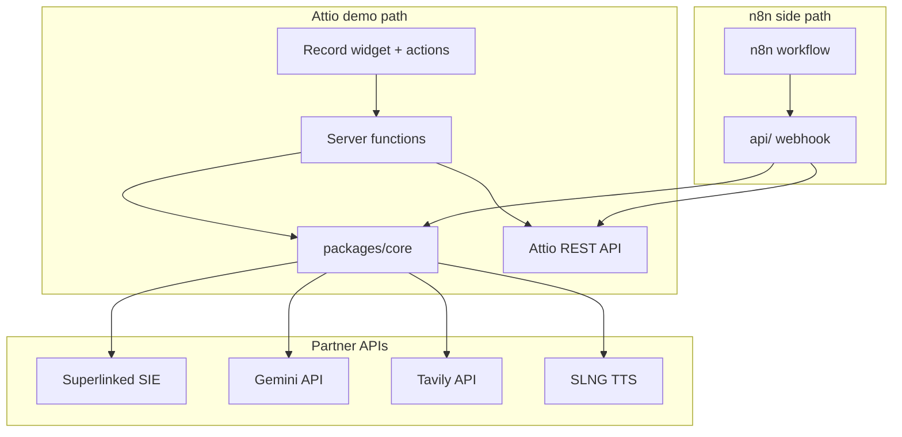

# Recruiting Copilot

> **Attio holds the context.** We research candidates, score semantic fit against the role, and draft HM notes and client submittals — **nothing writes to the CRM until a human approves.**

**Hackathon track:** Attio — The Agentic CRM  
**Partners used:** Attio · Superlinked SIE · Gemini · Tavily · n8n · SLNG · Aikido (security scan)

---

## 2-minute demo script

1. Open the **Recruiting** list — candidates visible, no fit scores yet.
2. Open a person → paste/show **CV text** → click **Research**.
3. Review fit %, tier, pros/cons, 2-liner, HM note → **edit one line** → **Approve**.
4. Fields populate; list re-sorts by `fit_score`.
5. **Bulk-research** two more candidates → top fit is obvious on the list.
6. Flash the **client submittal draft** — emphasize nothing is sent without approval.
7. *(Optional)* Click **Listen to summary** (SLNG) for a spoken top-3 overview.
8. *(Optional)* Show n8n workflow screenshot / live webhook trigger.

**Close:** *"Attio holds the context. We research, score fit, and draft what you need — nothing hits the CRM until you approve."*

---

## Prerequisites

- **Node.js 20+** (tested on 22.x)
- **pnpm 9+**
- Attio **developer account** + hackathon workspace
- API keys for partners (see table below)

---

## Quick start

```bash
git clone <this-repo>
cd attio-hack
cp .env.example .env
# Fill in keys (see Environment variables)
pnpm install
pnpm test
cd attio-app && pnpm dev
```

When `pnpm dev` prompts, select your hackathon workspace and install the app. Open any **Person** record to see the **Recruiting Copilot** widget.

Optional — n8n webhook API (isolated from Attio):

```bash
pnpm api:dev
# In another terminal: ngrok http 3001
```

Live pipeline smoke test (Superlinked + Gemini):

```bash
pnpm research:smoke
```

---

## Environment variables

Copy `.env.example` to `.env` and fill in:

| Variable | Required | Used by | Description |
|----------|----------|---------|-------------|
| `ATTIO_API_TOKEN` | api/ + local REST | Attio REST write-back | From [build.attio.com](https://build.attio.com) |
| `SUPERLINKED_API_KEY` | core | Fit scoring | Hackathon Discord / @filipmakraduli |
| `SUPERLINKED_CLUSTER_URL` | core | SIE cluster endpoint | Hackathon cluster URL (not localhost) |
| `SUPERLINKED_MODEL` | core | Embedding model | Default `BAAI/bge-m3` |
| `GEMINI_API_KEY` | core | Draft generation | [Google AI Studio](https://aistudio.google.com) |
| `GEMINI_MODEL` | core | LLM model | Default `gemini-2.5-flash` |
| `TAVILY_API_KEY` | core | Web enrichment | [tavily.com](https://tavily.com) |
| `ENABLE_TAVILY` | core | Feature flag | `true` to enrich thin CVs |
| `SLNG_API_KEY` | core | TTS audio | [app.slng.ai](https://app.slng.ai) |
| `ENABLE_SLNG` | core | Feature flag | `true` for audio summary |
| `WEBHOOK_SECRET` | api/ | n8n auth | Random string |
| `PORT` | api/ | HTTP port | Default `3001` |
| `API_PUBLIC_URL` | n8n | Public API URL | ngrok or deploy URL |

> Attio server functions receive secrets via the Attio developer dashboard — configure the same keys there for live research.

---

## Install each sponsor technology

### Attio (CRM + App SDK)

1. Create app at [build.attio.com](https://build.attio.com) with slug `recruiting-copilot`.
2. `cd attio-app && pnpm dev` — pick workspace, install app.
3. Extend workspace data model (if missing):
   - **Role** object: `title`, `description`
   - **Person**: `cv_text`, `linkedin_url`, `role` (ref → Role), `fit_score`, `fit_tier`, `two_liner`
   - **Recruiting list** with 3+ candidates linked to roles; sort by `fit_score` desc.

Docs: [Creating an app](https://docs.attio.com/sdk/guides/creating-an-app) · [REST API](https://docs.attio.com/rest-api/overview)

### Superlinked SIE (fit scoring)

```bash
pnpm add @superlinked/sie-sdk --filter @recruiting-copilot/core
```

Set `SUPERLINKED_API_KEY` + `SUPERLINKED_CLUSTER_URL`. Pre-warm cluster before demo (cold start 5–7 min).

Docs: [TypeScript SDK](https://superlinked.com/docs/reference/typescript-sdk/)

### Gemini (draft generation)

```bash
pnpm add @google/genai --filter @recruiting-copilot/core
```

Uses structured JSON output for the full draft bundle.

Docs: [Gemini API](https://ai.google.dev/gemini-api/docs)

### Tavily (web research fallback)

```bash
pnpm add @tavily/core --filter @recruiting-copilot/core
```

Triggers when CV &lt; 500 chars or LinkedIn URL present with CV &lt; 1500 chars. Set `ENABLE_TAVILY=true`.

Docs: [JS quickstart](https://docs.tavily.com/sdk/javascript/quick-start)

### n8n (workflow mirror)

1. `pnpm api:dev` + ngrok
2. Import [`n8n/recruiting-copilot.json`](n8n/recruiting-copilot.json)
3. Set `API_PUBLIC_URL` and `WEBHOOK_SECRET` in n8n env

See [docs/N8N.md](docs/N8N.md).

### SLNG (audio summary)

Set `SLNG_API_KEY` and `ENABLE_SLNG=true`. Use the **Listen to summary** widget on Person records.

Docs: [SLNG getting started](https://docs.slng.ai/getting-started)

### Aikido (security)

1. [aikido.dev](https://www.aikido.dev) → connect GitHub repo
2. Screenshot scan results for submission (see Security section below)

---

## Architecture



Full detail: [docs/ARCHITECTURE.md](docs/ARCHITECTURE.md) · API: [docs/API.md](docs/API.md) · Partners: [docs/PARTNERS.md](docs/PARTNERS.md)

---

## Partner technology usage

| Feature | Attio | Superlinked | Gemini | Tavily | n8n | SLNG |
|---------|-------|-------------|--------|--------|-----|------|
| Data model + UI | ✓ | | | | | |
| Fit % + tier | | ✓ | | | | |
| Pros/cons, gaps, drafts | | | ✓ | | | |
| Web bullets w/ sources | | | ✓ | ✓ | | |
| Approval write-back | ✓ | | | | | |
| Isolated webhook flow | ✓ | ✓ | ✓ | ✓ | ✓ | |
| Audio list summary | | | ✓ | | | ✓ |

---

## Repository layout

```
attio-hack/
├── packages/core/       # Shared pipeline + partner clients
├── attio-app/           # Attio App SDK (UI + server functions)
├── api/                 # Hono webhook for n8n (isolated)
├── n8n/                 # Importable workflow JSON
├── docs/                # Architecture, API, partner, n8n docs
└── .env.example
```

---

## Testing

```bash
pnpm test                 # Vitest — fit tiers, Zod bundles, webhook auth, Tavily triggers
pnpm research:smoke       # Live Superlinked + Gemini (requires .env keys)
```

| Test | Command / location |
|------|-------------------|
| Fit tier boundaries | `packages/core/src/pipeline/score-fit.test.ts` |
| Draft bundle schema | `packages/core/src/pipeline/generate-drafts.test.ts` |
| Pipeline orchestration | `packages/core/src/pipeline/run-research.test.ts` |
| Tavily trigger logic | `packages/core/src/clients/tavily.test.ts` |
| Attio payload builders | `packages/core/src/clients/attio-rest.test.ts` |
| Webhook auth | `api/src/index.test.ts` |

---

## Security (Aikido)

Connect this repository to [Aikido](https://www.aikido.dev) for dependency and secret scanning.

> **Submission:** Add a screenshot of the Aikido security report here after connecting the repo.
>
> `docs/assets/aikido-report.png` *(add after scan completes)*

Never commit `.env` — only `.env.example` is tracked.

---

## Troubleshooting

| Issue | Fix |
|-------|-----|
| SIE "warming up" / timeout | Cluster cold start — wait 5–7 min or pre-warm with `pnpm research:smoke` |
| Missing Role link error | Link Person → Role; ensure Role has `description` |
| Empty CV error | Paste CV in widget and click **Save CV** |
| n8n 401 | Match `X-Webhook-Secret` to `WEBHOOK_SECRET` |
| SLNG disabled | Set `ENABLE_SLNG=true` + `SLNG_API_KEY` in Attio app secrets |
| Bulk research capped | Max 5 candidates per run (by design) |

---

## Submission checklist

- [x] Public GitHub repo with README + docs
- [x] 3+ partner technologies (Attio, Superlinked, Gemini + Tavily, n8n, SLNG)
- [ ] 2-minute Loom demo video
- [ ] Aikido screenshot in README
- [ ] Submit by hackathon deadline

---

## License

Hackathon submission — MIT or as required by event organizers.
