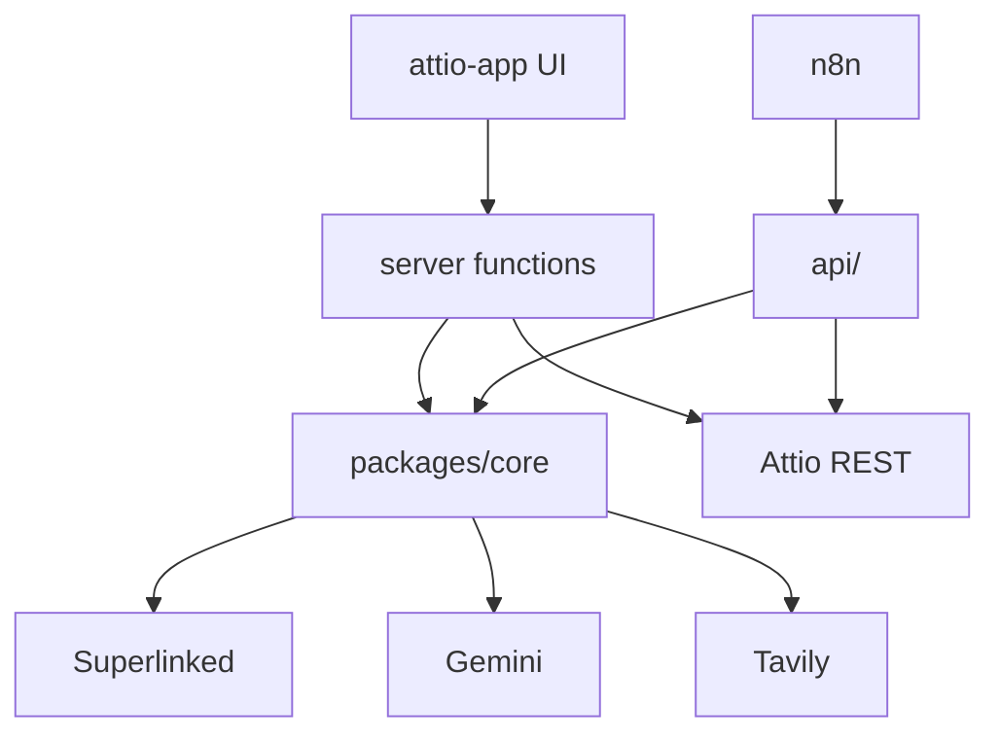

# Agent guide — Recruiting Copilot

This file is the single source of truth for AI agents working in this repository. Read it before making changes.

## What this project is

**Recruiting Copilot** is a hackathon Attio app that helps recruiters:

1. Research a candidate against a linked **Role** (job brief)
2. Score semantic **fit** (Superlinked SIE embeddings)
3. Generate **drafts** (Gemini): 2-liner, pros/cons, gaps, HM note, client submittal, email, web bullets
4. Show an **approval UI** — nothing writes to Attio until the recruiter approves
5. On approve: PATCH Person fields + POST HM note → recruiting list sorts by `fit_score`

**Pitch:** *Attio holds the context. We research, score fit, and draft what you need — nothing hits the CRM until you approve.*

**Track:** Attio — The Agentic CRM  
**Partners:** Attio · Superlinked · Gemini · Tavily · n8n · SLNG · Aikido (security scan only)

---

## Architecture (two isolated paths)

```
Attio path (primary demo):
  Record widget / actions → server functions (*.server.ts) → packages/core → partner APIs
  Server functions → Attio REST (PATCH fields, POST notes)

n8n path (side challenge, must not break Attio):
  n8n webhook → api/ (Hono) → packages/core → optional Attio REST write-back
```

**Critical rule:** The Attio app never calls `api/`. If n8n or `api/` fails, the Attio demo must still work.



Full diagrams: [docs/ARCHITECTURE.md](docs/ARCHITECTURE.md)

---

## Repository layout

```
attio-hack/
├── agent.md                 # This file — agent onboarding
├── README.md                # Jury-facing setup + demo script
├── .env.example             # All env vars (never commit .env)
├── package.json             # Root scripts: test, dev, research:smoke, api:dev
├── pnpm-workspace.yaml      # packages/*, attio-app, api
├── vitest.config.ts
│
├── packages/core/           # Shared pipeline — used by attio-app AND api/
│   ├── src/clients/         # attio-rest, sie, gemini, tavily, slng
│   ├── src/pipeline/        # score-fit, generate-drafts, enrich, run-research, summarize-list
│   ├── src/schemas/         # Zod: DraftBundle, FitResult, ResearchInput
│   ├── fixtures/            # sample-cv.txt, sample-role.txt
│   └── scripts/research-smoke.ts
│
├── attio-app/               # Attio App SDK (npm package name: recruiting-copilot)
│   ├── src/app.ts           # Entry: widgets, actions, bulkActions
│   ├── src/record/            # Widgets + approval dialog + research flow
│   ├── src/actions/           # Record + bulk actions
│   ├── src/server/            # *.server.ts — secrets + partner calls here only
│   └── src/graphql/           # Client-side GraphQL queries
│
├── api/                     # Hono webhook for n8n only
│   └── src/index.ts         # GET /health, POST /webhook/research
│
├── n8n/
│   └── recruiting-copilot.json
│
├── docs/
│   ├── ARCHITECTURE.md
│   ├── API.md               # Schemas, server fns, webhook contract
│   ├── PARTNERS.md
│   ├── N8N.md
│   └── assets/              # Aikido screenshot placeholder
│
└── mydocs/                  # UNTRACKED — personal/planning docs (gitignored)
```

---

## Attio data model

Configure in the hackathon workspace (extend only if missing):

| Object | Slug | Fields |
|--------|------|--------|
| Role | `roles` (custom) | `title`, `description` (job brief — fit scoring source) |
| Person | `people` | `name`, `linkedin_url`, `cv_text`, `role` (ref → Role), `fit_score`, `fit_tier`, `two_liner` |
| List | recruiting list | Person entries linked to Role; sort by `fit_score` desc |

**Fit tiers:** Strong ≥80 · Good 60–79 · Weak 40–59 · Unknown &lt;40 or missing input

**Select option slugs for `fit_tier`:** `strong`, `good`, `weak`, `unknown` (lowercase in REST payloads)

---

## Core pipeline (`packages/core`)

### `runResearch(input, deps)` — main orchestrator

1. Optional **Tavily** enrichment (`ENABLE_TAVILY=true`, thin CV or LinkedIn present)
2. **Superlinked** encode role (query) + CV (document) → cosine similarity → score + tier
3. **Gemini** structured JSON → `DraftBundle`

### Key types

```typescript
// ResearchResult
{ fit: { score, tier, rawSimilarity }, bundle: DraftBundle }

// DraftBundle fields
twoLiner, fitReasoning.{pros,cons}, gapAnalysis[], hmNote,
clientSubmittalDraft, candidateEmailDraft, webBullets[{text, source?}]
```

### Client modules

| File | Package | Purpose |
|------|---------|---------|
| `sie.ts` | `@superlinked/sie-sdk` | Embeddings, cosine similarity |
| `gemini.ts` | `@google/genai` | Structured output via Zod schema |
| `tavily.ts` | `@tavily/core` | Web search + LinkedIn extract |
| `slng.ts` | fetch | TTS → base64 WAV |
| `attio-rest.ts` | fetch | GET person/role, PATCH person, POST note |

### Fit scoring (`score-fit.ts`)

- Model: `BAAI/bge-m3` (env: `SUPERLINKED_MODEL`)
- Empty CV or role → tier `Unknown`, score `0`
- SIE cluster cold-starts 5–7 min — pre-warm with `pnpm research:smoke`

---

## Attio app (`attio-app/`)

### Entry points (`src/app.ts`)

| Type | ID | File |
|------|-----|------|
| Widget | `recruiting-copilot` | `record/recruiting-copilot-widget.tsx` |
| Widget | `recruiting-audio-summary` | `record/audio-summary.tsx` |
| Record action | `research-candidate` | `actions/research-candidate.ts` |
| Bulk action | `bulk-research` | `actions/bulk-research.ts` |

### Demo flow

1. Widget loads Person via GraphQL (`get-candidate-context.graphql`)
2. Recruiter pastes CV → **Save CV** → `save-cv-text.server.ts`
3. **Research** → `research-candidate.server.ts` → `runResearch()` (no Attio writes)
4. `showDialog` → `ApprovalDialog` — edit 2-liner + HM note
5. **Approve** → `approve-writeback.server.ts` → PATCH + note
6. **Reject** → close dialog, zero writes

### Server functions (rules)

- Files MUST be `*.server.ts` with `export default async function`
- Import `@recruiting-copilot/core` for pipeline logic
- Use `ATTIO_API_TOKEN` from `attio/server` for REST write-back
- Partner secrets via `process.env.*` — configure in Attio developer dashboard for production
- Client code cannot `fetch` externally — all HTTP in server functions

### Bulk research

- Max **5 candidates** per run (`actions/bulk-research.ts`)
- Partial failures don't stop other candidates
- Each success opens its own approval dialog

### SLNG audio

- Widget calls `summarize-list.server.ts` → Gemini script + SLNG TTS
- Requires `ENABLE_SLNG=true` + `SLNG_API_KEY` in app secrets

### Dev commands

```bash
cd attio-app && pnpm dev    # attio dev — pick workspace, install app
cd attio-app && pnpm build  # attio build
```

App slug in [build.attio.com](https://build.attio.com) should be `recruiting-copilot`.

---

## API server (`api/`)

Isolated Hono app for n8n — **not** used by Attio app.

| Endpoint | Auth | Purpose |
|----------|------|---------|
| `GET /health` | none | Connectivity check |
| `POST /webhook/research` | `X-Webhook-Secret` | Run pipeline, return `ResearchResult` |

Optional body flag `"approve": true` + `"recordId"` triggers Attio REST write-back (needs `ATTIO_API_TOKEN` in api env).

```bash
pnpm api:dev
# ngrok http 3001  → set API_PUBLIC_URL in n8n
```

See [docs/N8N.md](docs/N8N.md) and [n8n/recruiting-copilot.json](n8n/recruiting-copilot.json).

---

## Environment variables

Copy `.env.example` → `.env`. Never commit `.env`.

| Variable | Where |
|----------|-------|
| `ATTIO_API_TOKEN` | api/ local; auto-injected in Attio server fns |
| `SUPERLINKED_*` | core — cluster URL + API key required for scoring |
| `GEMINI_API_KEY` | core — required for drafts |
| `TAVILY_API_KEY` + `ENABLE_TAVILY` | core — optional enrichment |
| `SLNG_API_KEY` + `ENABLE_SLNG` | core — optional audio |
| `WEBHOOK_SECRET`, `PORT`, `API_PUBLIC_URL` | api/ + n8n |

Attio server functions need the same keys configured in the **Attio developer dashboard** app secrets.

---

## Testing

```bash
pnpm test              # 21 Vitest tests across core + api
pnpm research:smoke    # Live SIE + Gemini (needs .env keys)
```

| Area | Test file |
|------|-----------|
| Fit tier boundaries | `packages/core/src/pipeline/score-fit.test.ts` |
| Zod bundle parsing | `packages/core/src/pipeline/generate-drafts.test.ts` |
| Pipeline orchestration | `packages/core/src/pipeline/run-research.test.ts` |
| Tavily triggers | `packages/core/src/clients/tavily.test.ts` |
| Tavily enrichment | `packages/core/src/pipeline/enrich.test.ts` |
| Attio payloads | `packages/core/src/clients/attio-rest.test.ts` |
| Webhook auth | `api/src/index.test.ts` |
| List summary script | `packages/core/src/pipeline/summarize-list.test.ts` |

No Playwright E2E — manual Attio demo validation.

---

## Git conventions

### Commits

Only commit when the user asks. This repo was built in 3 phase commits:

1. `feat: monorepo, partner clients, core research pipeline, and attio scaffold`
2. `feat(attio): research, approval write-back, bulk research, and demo-ready UI`
3. `docs: partner setup, n8n workflow, side challenges, and submission assets`

### Do NOT track

- `.env` / secrets
- `mydocs/` — personal planning docs, including `recruiting_copilot_plan.md`
- `node_modules/`, `.attio/`, `lib/`, `.pnpm-store/`

The original build plan lives at `mydocs/recruiting_copilot_plan.md` (local only, gitignored).

---

## Common tasks for agents

### Add a new draft field

1. Extend `DraftBundleSchema` in `packages/core/src/schemas/draft-bundle.ts`
2. Update `buildDraftPrompt()` in `generate-drafts.ts`
3. Show in `approval-dialog.tsx` and `bundle-preview.tsx`
4. Add/update Vitest fixture JSON
5. Update `docs/API.md`

### Add a new partner integration

1. Thin client in `packages/core/src/clients/`
2. Wire into `run-research.ts` behind a feature flag
3. Add env vars to `.env.example`
4. Document in `docs/PARTNERS.md` + README
5. Add unit tests with mocked client

### Debug research failures

| Symptom | Likely cause |
|---------|----------------|
| "Missing Role" | Person not linked to Role or Role lacks `description` |
| "Empty CV" | CV not saved — click Save CV first |
| SIE timeout | Cluster cold start — wait or pre-warm |
| Gemini invalid JSON | Model returned malformed output — check `GEMINI_MODEL` |
| n8n 401 | `X-Webhook-Secret` mismatch |

### Attio SDK constraints

- No client-side `fetch` — use server functions
- `Button` only supports `secondary` / `destructive` variants; use `SubmitButton` from `useForm()` for forms
- Record widgets must return `<Widget>` as root
- GraphQL custom attributes need aliased `attribute(slug: "...")` fields

---

## Documentation map

| Audience | File |
|----------|------|
| Jury / setup | [README.md](README.md) |
| Agents | **agent.md** (this file) |
| Architecture | [docs/ARCHITECTURE.md](docs/ARCHITECTURE.md) |
| API contracts | [docs/API.md](docs/API.md) |
| Partner setup | [docs/PARTNERS.md](docs/PARTNERS.md) |
| n8n workflow | [docs/N8N.md](docs/N8N.md) |
| Attio app SDK notes | [attio-app/AGENTS.md](attio-app/AGENTS.md) (upstream template) |

---

## Submission checklist (hackathon)

- [x] Public repo with README + technical docs
- [x] 3+ partner technologies integrated
- [x] `pnpm test` green
- [ ] Loom 2-minute demo
- [ ] Aikido screenshot in README (`docs/assets/aikido-report.png`)
- [ ] Push to GitHub

---

## Principles when editing

1. **Minimize scope** — smallest correct diff
2. **Human approval gate** — never auto-write or auto-send
3. **Isolate n8n** — don't couple Attio app to `api/`
4. **Secrets in server only** — never client or committed files
5. **Match existing patterns** — Zod schemas, thin clients, Vitest mocks
