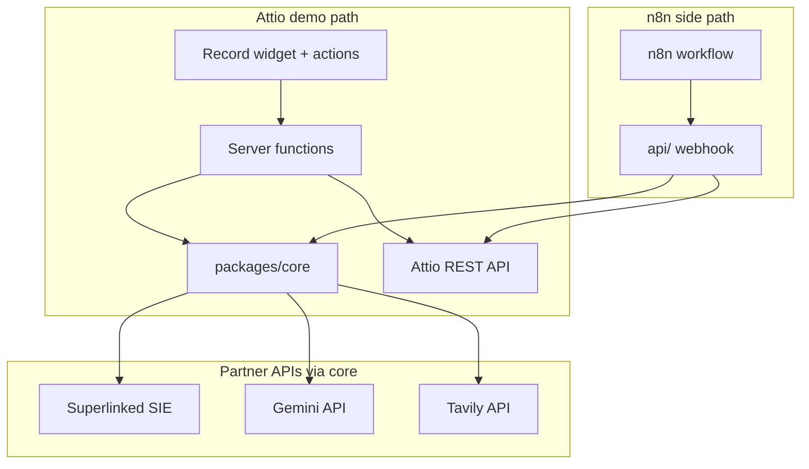

# Architecture

Recruiting Copilot uses a shared core pipeline consumed by two isolated paths:

## Data flow

1. Recruiter triggers research on a Person record (widget, action, or bulk).
2. Server function loads linked Role `description` + Person `cv_text` via GraphQL.
3. `runResearch()` scores fit (Superlinked) and generates drafts (Gemini).
4. Optional Tavily enrichment when CV is thin.
5. Recruiter reviews bundle in approval dialog — edit, Approve, or Reject.
6. On approve only: PATCH Person fields + POST HM note via Attio REST.

## Isolation guarantees

- The Attio app never calls `api/` — only n8n does.
- `api/` failure does not affect Attio server functions.
- Secrets stay in server functions and the standalone API process.
