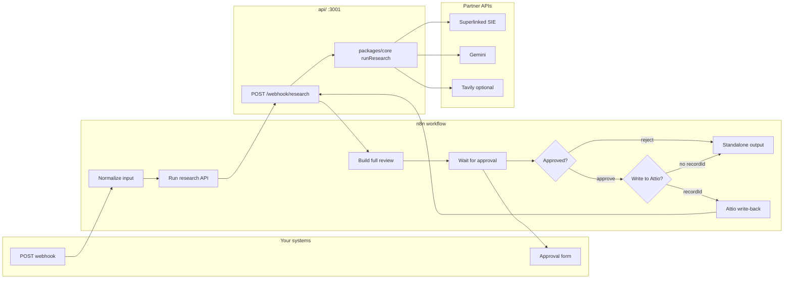

# n8n — standalone recruiting pipeline

Run the full **research → review → approve** flow **without Attio**. The Attio app never calls this path; if n8n or `api/` is down, the CRM demo still works.

Use this when you want your own stack: webhook in, scored fit + drafts out, human approval before anything is sent or written anywhere.

---

## What you get

| Step | What happens |
|------|----------------|
| 1. Webhook | You POST candidate + role JSON |
| 2. Research API | Superlinked fit score + Gemini drafts (same `packages/core` as Attio) |
| 3. Full review | Every field exposed: pros, cons, gaps, HM note, submittal, email, web bullets, markdown |
| 4. Manual approval | n8n **Wait** form — approve or reject |
| 5a. Standalone | Returns full JSON — copy drafts or chain Slack/Gmail/Sheets |
| 5b. Attio (optional) | If `recordId` set + approved → PATCH person + HM note via REST |

Nothing auto-sends. Nothing hits Attio unless you pass `recordId` and approve.

---

## Architecture



---

## Prerequisites

| Requirement | Notes |
|-------------|--------|
| Node.js 20+ | API server |
| pnpm 9+ | `pnpm install` from repo root |
| Docker (recommended) | `pnpm n8n:dev` — avoids 500MB+ npx download |
| `.env` keys | At minimum: `SUPERLINKED_*`, `GEMINI_API_KEY`, `WEBHOOK_SECRET` |

### Required `.env` (API / research)

```bash
SUPERLINKED_API_KEY=...
SUPERLINKED_CLUSTER_URL=...
GEMINI_API_KEY=...
WEBHOOK_SECRET=some-long-random-string
PORT=3001
API_PUBLIC_URL=http://localhost:3001
```

### Optional `.env`

| Variable | Purpose |
|----------|---------|
| `ATTIO_API_TOKEN` | Only for Attio write-back after approval |
| `ENABLE_TAVILY=true` + `TAVILY_API_KEY` | Web/LinkedIn bullets with sources |
| `GEMINI_MODEL` | Default `gemini-2.5-flash` |
| `SUPERLINKED_MODEL` | Default `BAAI/bge-m3` |

Copy from `.env.example`:

```bash
cp .env.example .env
```

---

## Quick start (standalone, no Attio)

### Terminal A — webhook API

```bash
pnpm install
pnpm api:dev
```

Health check:

```bash
curl http://localhost:3001/health
# → {"ok":true,"service":"recruiting-copilot-api","version":"0.0.1"}
```

### Terminal B — n8n (Docker, recommended)

```bash
pnpm n8n:dev
```

First visit **http://localhost:5678** → create local owner account.

Import workflow:

```bash
pnpm n8n:import
```

In n8n UI: open **Recruiting Copilot — standalone pipeline** → toggle **Active**.

### Smoke test (API only, no n8n UI)

```bash
pnpm n8n:smoke
```

Runs `n8n/sample-payload.json` against `POST /webhook/research`. Needs live Superlinked + Gemini keys (same as `pnpm research:smoke`).

---

## Webhook payload reference

**Endpoint (production):** `POST https://<your-n8n>/webhook/recruiting-copilot`  
**Endpoint (test / editor):** `POST https://<your-n8n>/webhook-test/recruiting-copilot`

**Content-Type:** `application/json`

### Required fields

| Field | Type | Description |
|-------|------|-------------|
| `candidateName` | string | Display name |
| `roleDescription` | string | Full role brief (used for semantic fit) |
| `cvText` | string | CV/resume plain text |

### Optional fields

| Field | Type | Default | Description |
|-------|------|---------|-------------|
| `roleTitle` | string | — | Short title for drafts |
| `linkedinUrl` | string | — | Used when Tavily enabled |
| `recordId` | string \| null | `null` | Attio Person record UUID |
| `writeToAttio` | boolean | `true` if `recordId` set | Set `false` to skip CRM even with `recordId` |

### Example — standalone (no CRM)

See `n8n/sample-payload.json`:

```json
{
  "candidateName": "Alex Morgan",
  "roleTitle": "Senior Full-Stack Engineer",
  "roleDescription": "Senior Full-Stack Engineer — London (hybrid)\n\nWe need...",
  "cvText": "Senior full-stack engineer with 8 years...",
  "linkedinUrl": "https://linkedin.com/in/alex-morgan",
  "recordId": null,
  "writeToAttio": false
}
```

### Example — with Attio write-back

```json
{
  "candidateName": "Alex Morgan",
  "roleDescription": "...",
  "cvText": "...",
  "recordId": "01932abc-def0-7890-abcd-ef1234567890",
  "writeToAttio": true
}
```

Requires `ATTIO_API_TOKEN` in repo `.env` (loaded by `api:dev`).

### curl — direct API (bypass n8n)

```bash
source .env  # or export WEBHOOK_SECRET manually

curl -sS -X POST "http://localhost:3001/webhook/research" \
  -H "Content-Type: application/json" \
  -H "X-Webhook-Secret: $WEBHOOK_SECRET" \
  -d @n8n/sample-payload.json | jq .
```

### curl — n8n webhook (after workflow is active)

```bash
# Production URL (workflow active)
curl -sS -X POST "http://localhost:5678/webhook/recruiting-copilot" \
  -H "Content-Type: application/json" \
  -d @n8n/sample-payload.json

# Test URL (from n8n editor — works while building)
curl -sS -X POST "http://localhost:5678/webhook-test/recruiting-copilot" \
  -H "Content-Type: application/json" \
  -d @n8n/sample-payload.json
```

> n8n waits on the **approval form** before responding. Open the execution in the n8n UI, click the **Wait for approval** node, and submit the form.

---

## Workflow nodes (imported JSON)

File: `n8n/recruiting-copilot.json`

| Node | Purpose |
|------|---------|
| **Webhook** | `POST /recruiting-copilot` |
| **Normalize input** | Validates required fields; handles `$json.body` vs root |
| **Prepare research body** | Builds safe JSON (no string-escape bugs on multiline CVs) |
| **Run research API** | `POST $API_PUBLIC_URL/webhook/research` with `X-Webhook-Secret` |
| **Build full review** | Flattens all bundle fields + `reviewMarkdown` |
| **Wait for approval** | Form: approve / reject + optional notes |
| **Approved?** | Branch on decision |
| **Write to Attio?** | `recordId` + `writeToAttio` |
| **Attio write-back API** | Same endpoint with `approve: true` |
| **Standalone approved output** | Full JSON for your integrations |
| **Attio approved output** | Confirms CRM write |
| **Rejected output** | No external writes |

### Response fields (standalone approved)

```json
{
  "status": "approved",
  "mode": "standalone",
  "candidateName": "...",
  "fitScore": 87,
  "fitTier": "Strong",
  "twoLiner": "...",
  "pros": ["...", "..."],
  "cons": ["..."],
  "gapAnalysis": [{ "area": "...", "gap": "...", "severity": "medium" }],
  "hmNote": "...",
  "clientSubmittalDraft": "...",
  "candidateEmailDraft": "...",
  "webBullets": [{ "text": "...", "source": "https://..." }],
  "reviewMarkdown": "# Candidate review: ...",
  "reviewSummary": "Fit 87% (Strong) — ...",
  "reviewerNotes": null,
  "message": "Approved — standalone mode..."
}
```

---

## Environment variables in n8n

### Docker (`pnpm n8n:dev`)

`docker-compose.yml` loads repo `.env` and passes:

| Container env | Source | Used for |
|---------------|--------|----------|
| `API_PUBLIC_URL` | `.env` or default `http://host.docker.internal:3001` | HTTP Request URLs |
| `WEBHOOK_SECRET` | `.env` | `X-Webhook-Secret` header |
| `N8N_BLOCK_ENV_ACCESS_IN_NODE` | `false` | Allows `$env.WEBHOOK_SECRET` in nodes |

`host.docker.internal` lets the n8n container reach the API on your Mac/Windows host. On Linux, use your machine IP or run API in Docker on the same network.

### npx fallback (`pnpm n8n:dev:npx`)

Set in n8n **Settings → Variables**:

- `API_PUBLIC_URL` = `http://localhost:3001`
- `WEBHOOK_SECRET` = same as `.env`

Or export before start:

```bash
export API_PUBLIC_URL=http://localhost:3001
export WEBHOOK_SECRET=your-secret
pnpm n8n:dev:npx
```

---

## Public demo (ngrok)

```bash
# Terminal A
pnpm api:dev

# Terminal B
ngrok http 3001
```

Set in `.env`:

```bash
API_PUBLIC_URL=https://abc123.ngrok-free.app
```

Restart n8n if using Docker so it picks up the new URL.

---

## Wire your own outputs (after approval)

Open the workflow in n8n and connect nodes after **Standalone approved output**:

| Integration | Field to send |
|-------------|---------------|
| Slack | `{{ $json.reviewMarkdown }}` |
| Gmail | `{{ $json.clientSubmittalDraft }}` |
| Google Sheets | `fitScore`, `fitTier`, `candidateName` |
| Notion | `reviewMarkdown` |
| Your ATS | `clientSubmittalDraft` |

For Attio, pass `recordId` in the webhook body — no extra nodes needed.

---

## Scripts

| Command | What it does |
|---------|----------------|
| `pnpm api:dev` | Start Hono webhook API on `:3001` |
| `pnpm docker:prune` | Drop Docker build cache + dangling images |
| `pnpm n8n:dev` | n8n UI on `:5678` (Docker; prunes cache first) |
| `pnpm n8n:dev:npx` | n8n without Docker (slow first run) |
| `pnpm n8n:import` | Import workflow (prunes cache first) |
| `pnpm n8n:smoke` | Test API only (`scripts/n8n-smoke.mjs`) |
| `pnpm n8n:test` | API + n8n webhook (if `N8N_WEBHOOK_URL` set) |

---

## Troubleshooting

| Symptom | Fix |
|---------|-----|
| `401 Unauthorized` on research API | `WEBHOOK_SECRET` must match in `.env` and n8n `$env` / HTTP header |
| `ECONNREFUSED` from n8n to API | Docker: use `http://host.docker.internal:3001`. npx: use `http://localhost:3001` |
| `Missing partner API configuration` | Set `SUPERLINKED_*` and `GEMINI_API_KEY` in `.env`; restart `pnpm api:dev` |
| SIE timeout / warming up | Pre-warm: `pnpm research:smoke` (cold cluster 5–7 min) |
| Webhook returns empty / hangs | Workflow paused at **Wait for approval** — complete the form in n8n executions |
| `undefined` for candidate fields | Webhook data is under `$json.body` — **Normalize input** handles this |
| Multiline CV breaks research | Fixed in v2 workflow — uses Code node + `jsonBody: {{ $json }}` not string templates |
| Attio write-back skipped | Need `recordId`, approval = approve, `writeToAttio: true`, `ATTIO_API_TOKEN` in `.env` |
| npx import very slow / ENOSPC | Use Docker: `pnpm n8n:import` (auto-prunes cache). Free disk space if npx still fails |
| n8n 2.x Node engine warning | Use Docker image or Node ≥ 22.22 for npx |

---

## Validation checklist

- [ ] `curl localhost:3001/health` → `ok: true`
- [ ] `pnpm n8n:smoke` → fit score + bundle fields
- [ ] Attio app works with `api/` **stopped**
- [ ] n8n execution shows full `reviewMarkdown` before approval
- [ ] Reject path → `status: rejected`, no Attio writes
- [ ] Approve standalone → all draft fields in response JSON
- [ ] Approve + `recordId` → Person fields updated in Attio

---

## Files

| Path | Description |
|------|-------------|
| `n8n/recruiting-copilot.json` | Importable workflow |
| `n8n/sample-payload.json` | Test candidate + role |
| `scripts/n8n-smoke.mjs` | API smoke test |
| `api/src/index.ts` | Webhook handler |
| `docker-compose.yml` | n8n + env wiring |
| `docs/API.md` | ResearchResult schema |
